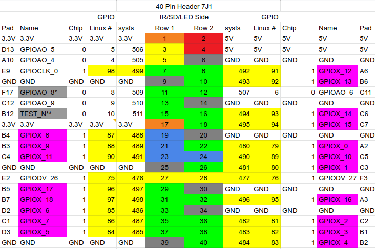

Importing the module
====================

To import the libregpio module:

.. code-block::

       import libregpio as GPIO
       
This way allows you to refer to it as GPIO for the rest of your program.

PIN Reference
=============

This module is designed to work with the 40-pin chip of Libre Computer AML-S905X-CC "LePotato".

Please, see Libre Computer's GPIO Headers Reference for full documentation: https://docs.google.com/spreadsheets/d/1U3z0Gb8HUEfCIMkvqzmhMpJfzRqjPXq7mFLC-hvbKlE/edit#gid=0

To access GPIO pins with this module, a class instance needs to be created. The pins are referred to by their GPIO name.

This is an example of an ``IN`` (input) class instance set to use 'GPIOX_4' pin:

.. code-block::

       import libregpio as GPIO

        a_pin = GPIO.IN('GPIOX_4')
       

API documentation
=================

.. automodule:: libregpio
   :members:
   :undoc-members:
   :show-inheritance:
